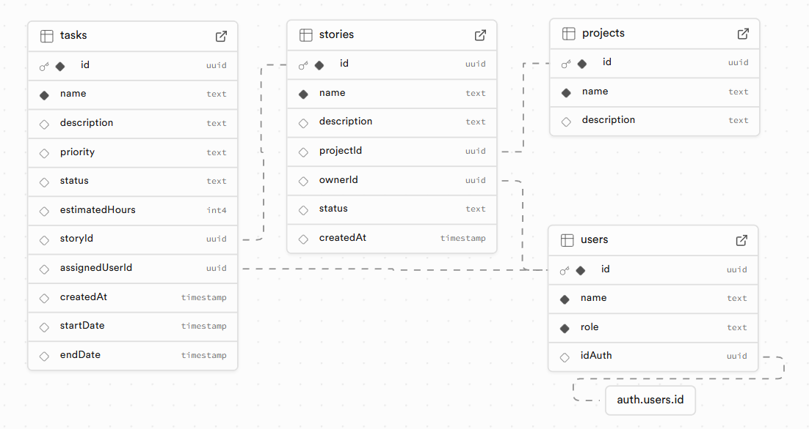

# **ManagMe**

### Programowanie aplikacji webowych
**lab5/3/PROGN**

*Kamil Nowakowski*
*14150*

---

## 👤 Przykładowe konta użytkowników

Można skorzystać z poniższych danych do logowania w środowisku testowym:

| Rola       | Login                | Hasło       |
|------------|----------------------|-------------|
| Admin      | `admin@example.com`  | `admin123`  |
| DevOps     | `marek@example.com`  | `haslo123`  |
| Developer  | `anna@example.com`   | `haslo123`  |

> ⚠️ **Uwaga:** Te konta są przeznaczone wyłącznie do celów testowych i demonstracyjnych. Nie używaj ich w środowisku produkcyjnym.

---

## 🔗 Struktura nawigacji

### 🌐 Strony

- `/` – Strona główna
- `/login` – Logowanie użytkownika
- `/logout` – Wylogowanie użytkownika

### 📁 Projekty

- `/project` – Lista wszystkich projektów
- `/project/add` – Tworzenie nowego projektu
- `/project/:projectId` – Szczegóły projektu
- `/project/edit/:projectId` – Edycja projektu
- `/project/delete/:projectId` – Usunięcie projektu

### 📘 Historie

- `/project/:projectId/stories` – Lista historii użytkownika w danym projekcie
- `/project/:projectId/stories/add` – Dodanie nowej historii
- `/project/:projectId/stories/:storyId` – Szczegóły historii
- `/project/:projectId/stories/edit/:storyId` – Edycja historii
- `/project/:projectId/stories/delete/:storyId` – Usunięcie historii

### ✅ Zadania

- `/project/:projectId/stories/:storyId/tasks/` – Lista zadań w historii
- `/project/:projectId/stories/:storyId/tasks/add` – Dodanie nowego zadania
- `/project/:projectId/stories/:storyId/tasks/:tasksId` – Szczegóły zadania
- `/project/:projectId/stories/:storyId/tasks/edit/:tasksId` – Edycja zadania
- `/project/:projectId/stories/:storyId/tasks/delete/:tasksId` – Usunięcie zadania
- `/project/:projectId/stories/:storyId/tasks/:tasksId/assign` – Przypisanie użytkownika do zadania
- `/project/:projectId/stories/:storyId/tasks/:tasksId/done` – Oznaczenie zadania jako zakończone

---

## SuperBase
🔗 [Odwiedź Supabase](https://supabase.com)

